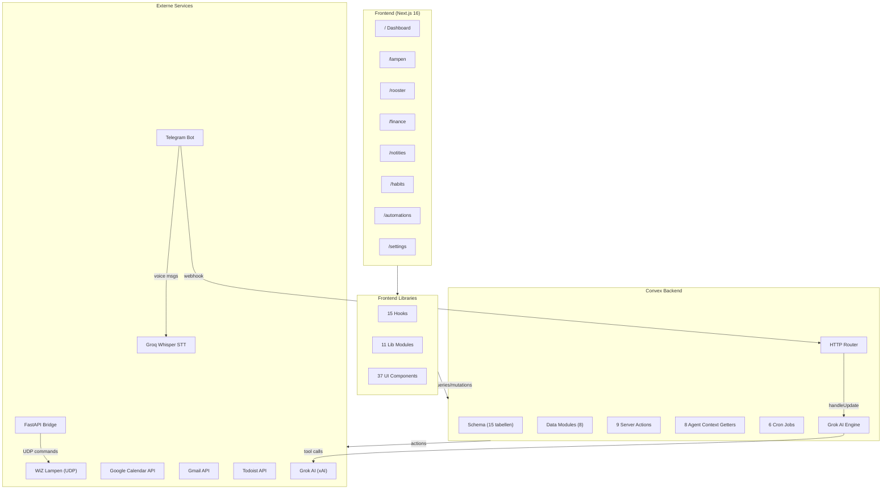

# JeffriesHomeapp — 100% Volledige Codebase Analyse

> **Doel:** Persoonlijke smart home dashboard voor Jeffrey — combineert lampsturing, werkrooster, financiën, agenda, email, habits/gamification en AI-gestuurde automatisering in één app.

---

## 1. Tech Stack

| Laag | Technologie | Versie |
|------|-------------|--------|
| **Frontend** | Next.js (App Router) | 16.1.6 |
| **UI** | React 19 + Tailwind CSS v4 + Framer Motion 12 | - |
| **State** | Zustand + TanStack React Query | 5.x |
| **Backend** | Convex (real-time serverless) | 1.33 |
| **Auth** | Clerk (`@clerk/nextjs` v7) + Convex-Clerk bridge | - |
| **Charts** | Recharts 3 | - |
| **Icons** | Lucide React | - |
| **Color Picker** | react-colorful (HexColorPicker) | - |
| **AI Model** | `grok-4-1-fast` (xAI) via OpenAI-compatible API | - |
| **Voice STT** | Groq `whisper-large-v3` (Nederlands) | - |
| **External APIs** | Google Calendar, Gmail, Todoist, WiZ (UDP), Telegram Bot | - |
| **Deployment** | Vercel (security headers in `vercel.json`) | - |
| **Font** | Inter (Google Fonts, preloaded) | - |

---

## 2. Architectuur Diagram



---

## 3. Database Schema (15 tabellen)

| Tabel | Beschrijving | Key Fields | Indices |
|-------|-------------|------------|---------|
| **devices** | WiZ smart lampen | name, ipAddress, status, currentState (on/brightness/color_temp/r/g/b) | `by_user`, `by_user_ip` |
| **deviceCommands** | Command queue (Telegram/AI → lokale bridge) | userId, command, bron, status | `by_status`, `by_user` |
| **chatMessages** | Telegram conversatie geheugen | chatId, role, content, agentId | `by_chat` |
| **automations** | Tijdgestuurde lamp-automaties | name, trigger (time/days/shiftType), action (type/scene/brightness), group, lastFiredAt | `by_user` |
| **schedule** | Werkdiensten (Google Calendar sync) | eventId, startDatum, shiftType, startTijd, eindTijd, duur, locatie, team, status | `by_user`, `by_user_date`, `by_user_eventId` |
| **scheduleMeta** | Import metadata | importedAt, fileName, totalRows | `by_user` |
| **salary** | Salarisberekening per maand | periode, basisLoon, ortTotaal, brutoBetaling, nettoPrognose | `by_user`, `by_user_periode` |
| **transactions** | Rabobank CSV import | datum, bedrag, saldoNaTrn, code, tegenpartijNaam, omschrijving, categorie, isInterneOverboeking | `by_user`, `by_user_datum`, `by_user_categorie`, `by_rekening_volgnr` |
| **personalEvents** | Persoonlijke Google Agenda | eventId, titel, startDatum, heledag, status (Aankomend/PendingCreate/PendingDelete/Voorbij/VERWIJDERD), kalender | `by_user`, `by_user_date`, `by_user_status`, `by_user_eventId` |
| **emails** | Gmail metadata + snippet | gmailId, threadId, from, subject, snippet, searchText, isGelezen, isSter, isVerwijderd, categorie | `by_user`, `by_user_datum`, `by_user_thread`, `by_user_gmailId`, `search_emails` (FTS) |
| **emailSyncMeta** | Gmail sync cursor (incremental) | historyId, lastFullSync, totalSynced | `by_user` |
| **loonstroken** | Uploaded loonstrook data | userId, jaar, periode, brutoloon, nettoloon, uren | `by_user`, `by_user_periode` |
| **notes** | Persoonlijke notities | userId, titel?, inhoud, tags?, kleur?, isPinned, isArchived, deadline?, linkedEventId?, prioriteit?, aangemaakt, gewijzigd | `by_user`, `by_user_pinned`, `by_user_deadline`, `search_notes` (FTS) |
| **habits** | Gewoontes met gamification | userId, naam, emoji, type (positief/negatief), frequentie (dagelijks/weekdagen/weekenddagen/aangepast/x_per_week/x_per_maand), moeilijkheid, kleur, roosterFilter?, isKwantitatief, doelWaarde?, eenheid?, doelTijd?, doelAantal?, status (actief/gepauzeerd/gearchiveerd), huidigeStreak, langsteStreak, totaalVoltooid, totaalIncidenten, xp, badges[], logboek[] (datum/voltooid/isIncident/notitie/waarde) | `by_user`, `by_user_status` |

---

## 4. Convex Server Actions — Volledige Analyse (9 bestanden)

### 4.1 [syncSchedule.ts](file:///c:/Users/JJALa/Desktop/2026Developer/JeffriesHomeapp/convex/actions/syncSchedule.ts) (178 regels)
- **Calendar ID:** SDB Planning kalender (hardcoded `.ics` import URL)
- **Scan window:** -30 → +90 dagen
- **Keyword filter:** `KEYWORDS_INCLUDE` (dienst, sdb, shift) en `KEYWORDS_EXCLUDE` (vrij, vakantie)
- **Event parsing:** All-day vs timed events, shiftType auto-detectie (`<10h = Vroeg`, `≥13h = Laat`), team prefix uit locatie
- **Helpers:** `datumStr()`, `tijdStr()` (CET-aware), `weeknr()` (ISO week), `duurUren()`, `getTeam()`, `getStatus()`
- **Exports:** `syncFromCalendar` (internalAction), `syncNow` (public action)

### 4.2 [syncPersonalEvents.ts](file:///c:/Users/JJALa/Desktop/2026Developer/JeffriesHomeapp/convex/actions/syncPersonalEvents.ts) (124 regels)
- **Calendar:** `primary` (gebruiker's hoofd Google Calendar)
- **Geen keyword filter** — alle events worden opgenomen
- **Status:** simpel: `start < now ? "Voorbij" : "Aankomend"`
- **Delegeert:** `personalEvents.bulkUpsertFromCalendar` (met orphan detectie)

### 4.3 [syncGmail.ts](file:///c:/Users/JJALa/Desktop/2026Developer/JeffriesHomeapp/convex/actions/syncGmail.ts) (242 regels)
- **Twee modi:**
  - **Incremental sync:** `gmail.users.history.list()` met startHistoryId → detecteert gewijzigde message IDs
  - **Full sync (fallback):** Haalt laatste 200 messages op, met reconciliatie (orphan cleanup via `bulkDeleteByGmailIds`)
- **Batch processing:** 20 parallelle `messages.get()` calls per batch (`Promise.allSettled`)
- **Email parsing:** `parseEmail()` helper extraheert headers, labels, snippet, bijlagen count, searchText
- **Label categorisatie:** `categorizeLabels()` → primary/social/promotions/updates/forums
- **HistoryId fallback:** Als history verlopen (404) → automatisch full sync

### 4.4 [sendGmail.ts](file:///c:/Users/JJALa/Desktop/2026Developer/JeffriesHomeapp/convex/actions/sendGmail.ts) (427 regels — **grootste action**)
- **`buildRawEmail()`:** Handmatige RFC 2822 email constructie → URL-safe Base64 encoding
- **15 exports** — elk heeft zowel een public als internal variant:

| Public | Internal | Functie |
|--------|----------|---------|
| `sendEmail` | `sendEmailInternal` | Nieuw email versturen |
| `replyToEmail` | `replyToEmailInternal` | Reply op thread (auto In-Reply-To/References) |
| `trashEmail` | `trashEmailInternal` | Naar prullenbak |
| `untrashEmail` | - | Herstel uit prullenbak |
| `modifyLabels` | - | Labels toevoegen/verwijderen |
| `markGelezen` | `markGelezenInternal` | Gelezen/ongelezen toggle |
| `markSter` | `markSterInternal` | Ster toggle |
| `bulkMarkGelezen` | `bulkMarkGelezenInternal` | Batch gelezen (batchModify API) |
| `bulkTrash` | `bulkTrashInternal` | Batch verwijder (batchModify + TRASH label) |

- **Dual-write pattern:** Elke operatie → Gmail API call + Convex mutation (simultaan)

### 4.5 [getGmailBody.ts](file:///c:/Users/JJALa/Desktop/2026Developer/JeffriesHomeapp/convex/actions/getGmailBody.ts) (169 regels)
- **On-demand:** Body wordt NIET opgeslagen in Convex (bespaart ~50KB × duizenden emails)
- **`extractBody()`:** Recursieve MIME decoder (multipart/mixed → multipart/alternative → text/html + text/plain)
- **`extractAttachments()`:** Recursieve bijlage-metadata extractor (filename, mimeType, size, attachmentId)
- **Base64 decode:** URL-safe base64 → UTF-8 (`-` → `+`, `_` → `/`)
- **Exports:** `getBody` (public), `getAttachment` (public), `getBodyInternal` (voor Grok)

### 4.6 [processPendingCalendar.ts](file:///c:/Users/JJALa/Desktop/2026Developer/JeffriesHomeapp/convex/actions/processPendingCalendar.ts) (195 regels)
- **Verwerkt twee queues:**
  1. **PendingCreate** → Make Google Calendar event (met categorie-kleurcodering)
  2. **PendingDelete** → Delete van Google Calendar + hard delete uit Convex DB
- **9 Google Calendar kleurcodes** (sociaal=Peacock, werk=Blueberry, gezondheid=Tomato, etc.)
- **Categorie extractie:** `[categorie:xxx]` tag uit beschrijving → `colorId` mapping
- **Smart defaults:** Hele-dag events: reminder op 1 dag, timed events: 30min + 1 dag
- **Error handling:** Bij fout → status="Fout"; bij delete fout (404/410) → toch lokaal verwijderen
- **Pending ID detectie:** `::pending::` in eventId → nooit naar Google gestuurd

### 4.7 [updatePersonalEvent.ts](file:///c:/Users/JJALa/Desktop/2026Developer/JeffriesHomeapp/convex/actions/updatePersonalEvent.ts) (93 regels)
- **Dual-write:** Als `kalender === "Main"` → patch in Google Calendar API, dan lokaal in Convex
- **Smart type switching:** Hele-dag ↔ timed events correct afhandelen (date vs dateTime + null clearing)
- **Pending check:** Skip Google API als eventId bevat `::pending::`

### 4.8 [deletePersonalEvent.ts](file:///c:/Users/JJALa/Desktop/2026Developer/JeffriesHomeapp/convex/actions/deletePersonalEvent.ts) (62 regels)
- **Same pattern:** Check kalender + pending status → optioneel Google Calendar delete → altijd lokale delete
- **Graceful:** 404/410 van Google → accepteren (al verwijderd)

### 4.9 [syncTodoist.ts](file:///c:/Users/JJALa/Desktop/2026Developer/JeffriesHomeapp/convex/actions/syncTodoist.ts) (209 regels)
- **Flow:** Lees schedule tabel → vergelijk met bestaande Todoist taken → maak/update/sluit
- **EID tracking:** `[EID:eventId]` tag in Todoist task description → dedup key
- **Hash comparison:** `startDatum|startTijd|eindTijd|locatie` → update alleen bij wijziging
- **Taak titels:** `R. Vroeg` of `A. Laat` (team + shiftType)
- **Duur integratie:** `duration` + `duration_unit: "minute"` in Todoist API
- **Orphan cleanup:** Verlopen taken (due < today en niet meer in schedule) → `.../close`
- **Paginated fetch:** Cursor-based pagination voor alle bestaande taken

---

## 5. Convex Lib Modules (6 bestanden)

### 5.1 [googleAuth.ts](file:///c:/Users/JJALa/Desktop/2026Developer/JeffriesHomeapp/convex/lib/googleAuth.ts) (31 regels)
- **Factory:** `createOAuthClient()` → `google.auth.OAuth2` met refresh token
- **Env vars:** `GOOGLE_CLIENT_ID`, `GOOGLE_CLIENT_SECRET`, `GOOGLE_REFRESH_TOKEN`
- **Geïmporteerd door:** Alle 7 actions die Google API gebruiken

### 5.2 [autoCategorie.ts](file:///c:/Users/JJALa/Desktop/2026Developer/JeffriesHomeapp/convex/lib/autoCategorie.ts) (76 regels)
- **24 regex regels** voor automatische categorisering van banktransacties
- **Categorieën:** Gaming, Streaming, Crypto, SaaS, Online Winkelen, Verzekeringen, Telecom, Brandstof, Vervoer, Boodschappen, Fastfood, Sport, Salaris, Toeslagen, Vaste Lasten, Geldopname, Coffeeshop, Familie, Vrienden, Zakelijk, Vakantie, Vrije Tijd
- **Edge case:** Supertank → <€25 = Fastfood, ≥€25 = Brandstof
- **Single Source of Truth:** Geïmporteerd door zowel client (`rabobank-csv.ts`) als server (`transactions.ts relabelAll`)

### 5.3 [salaryCalc.ts](file:///c:/Users/JJALa/Desktop/2026Developer/JeffriesHomeapp/convex/lib/salaryCalc.ts) (283 regels)
- Complex ORT (Onregelmatigheidstoeslag) berekening
- Nederlandse loonheffingstabel 2026
- PFZW pensioenberekening (12.95%)
- `computeSalary()` als hoofd-export

### 5.4 [fields.ts](file:///c:/Users/JJALa/Desktop/2026Developer/JeffriesHomeapp/convex/lib/fields.ts) (48 regels)
- **Gedeelde Convex validators:** `dienstFields` en `eventFields`
- Voorkomt duplicatie tussen mutations en queries

### 5.5 [config.ts](file:///c:/Users/JJALa/Desktop/2026Developer/JeffriesHomeapp/convex/lib/config.ts) (10 regels)
- **Single constant:** `JEFFREY_USER_ID` (Clerk User ID)
- Gebruikt door alle cron jobs voor de hardcoded single-user

### 5.6 [habitConstants.ts](file:///c:/Users/jeffrey/Desktop/Projecten/JeffriesHomeapp/convex/lib/habitConstants.ts) (~150 regels)
- **Gamification engine:** Exponentieel XP-model (12 levels: Beginner → Legende)
- **XP per moeilijkheid:** makkelijk=5, normaal=10, moeilijk=20
- **13 badges:** Gebaseerd op streaks (7d, 30d, 100d, 365d) en totaal voltooiingen (10, 50, 100, 500, 1000)
- **Emoji presets:** `HABIT_EMOJIS` (30 emoji's, 5 categorieën: Gezondheid, Sport, Studie, Voeding, Lifestyle)
- **Rooster filter opties:** alle/vroege_dienst/late_dienst/vrije_dag/werkdag
- **`calculateLevel(xp)`**, **`checkBadges(streak, total)`** — pure functies

---

## 6. AI Agent Agency — Volledige Analyse

### 6.1 [registry.ts](file:///c:/Users/JJALa/Desktop/2026Developer/JeffriesHomeapp/convex/ai/registry.ts) (94 regels)

### 6.1b [router.ts](file:///c:/Users/JJALa/Desktop/2026Developer/JeffriesHomeapp/convex/ai/router.ts) (82 regels)
- **Agent Agency Router** — Convex queries voor agent discovery en context
- **3 queries:** `listAgents` (discovery), `getAgentContext` (volledige context ophalen), `getBriefing` (dashboard shortcut)
- **1 internal query:** `internalGetAgentContext` (callable vanuit actions/grok.ts)

**Type systeem:**
- `AgentDefinition` — id, naam, emoji, beschrijving, domein[], capabilities[], tools[], `getContext(ctx, userId, opts?)`
- `ContextOptions` — `{ lite?: boolean }` voor compact/full mode
- `AgentTool` — naam, type (query/mutation/action), parameters[]
- `ToolParameter` — naam, type, beschrijving, verplicht, enum?, default?
- `toMeta()` — Strip `getContext` voor API responses

**Registry:** Array van 8 `AgentDefinition` objecten, opzoekbaar via `getAgent(id)`

### 6.2 Agent Context Getters

Elke agent heeft een `getContext()` functie die **live data** ophaalt uit Convex en formatteert als JSON voor de Grok system prompt.

| Agent | Lite Output | Full Output |
|-------|-------------|-------------|
| **dashboard** | N/A (IS de lite aggregator) | datum/dag/tijdstip + lite output van alle 5 sub-agents (via `Promise.all`) |
| **lampen** | totaal/online/aan + actieve automations count | Per-lamp details (ip/status/rgb/helderheid) + alle automations met triggers/acties |
| **rooster** | dienst vandaag + komende count + conflicten | 7-dagen planning (diensten + afspraken per dag) + statistieken + conflicten (max 10) + aankomende events (max 10) |
| **finance** | salaris huidig (bruto/netto/ort) + periode | Salary history (6 maanden) + 30-dagen categorie verdeling + top 10 uitgaven + in/uit balans |
| **email** | totaal/ongelezen/prullenbak | Stats (inbox/ongelezen/ster/verzonden) + top 10 afzenders + categorie verdeling + triage suggesties + 15 recente emails |
| **automations** | totaal/actief | Alle regels met triggers + 5 cron jobs info + sync health (rooster/gmail/todoist/calendar) |
| **notes** | totaal/pin count + recente titels | Alle notities (id/titel/inhoud/tags/isPinned/deadline/linkedEventId/prioriteit/aangemaakt/gewijzigd) + pin count |
| **habits** | totaalHabits/actief/streak overview + vandaag voortgang | Alle habits met huidige status + daglog + streaks + XP/level + badges + weekstatistieken + rooster-integratie |

**Key pattern:** Dashboard agent roept alle andere agents aan met `{ lite: true }` — voorkomt enorme context window bij de briefing.

### 6.3 Grok Chat Flow + Telegram Integratie

**Chat loop** ([chat.ts](file:///c:/Users/JJALa/Desktop/2026Developer/JeffriesHomeapp/convex/ai/grok/chat.ts), 155 regels):
1. `chat()` action ontvangt vraag + agentId + history
2. Haalt agent context op via `internalGetAgentContext`
3. Bouwt system prompt: `buildSystemPrompt(agentMeta, context)`
4. Loop (max rounds): Grok API call → tool calls parallel uitvoeren → resultaat terug naar Grok
5. Return: antwoord + agent meta + token usage

**Telegram Bot** ([bot.ts](file:///c:/Users/JJALa/Desktop/2026Developer/JeffriesHomeapp/convex/telegram/bot.ts), 277 regels):
- **16 slash commando's:**

| Commando | Agent | Functie |
|----------|-------|---------|
| `/briefing` | dashboard | Dagelijkse briefing |
| `/lampen` | lampen | Lamp status |
| `/rooster` | rooster | Weekplanning |
| `/afspraak` | rooster | Afspraak beheren |
| `/agenda` | rooster | Agenda overzicht |
| `/finance` | finance | Salaris & transacties |
| `/email` | email | Inbox overzicht |
| `/inbox` | email | Inbox analyse |
| `/compose` | email | Email componeren |
| `/triage` | email | Inbox triage |
| `/search` | email | Email zoeken |
| `/automations` | automations | Automations status |
| `/notities` | notes | Notitie overzicht |
| `/noteer` | notes | Snelle notitie aanmaken |
| `/habits` | habits | Habit overzicht + streaks |
| `/streak` | habits | Huidige streak status |
| `/check` | habits | Habit afvinken |
| `/help` | - | Alle commando's tonen |

- **Smart keyword routing** (`detectAgent()`): 6 keyword sets → agent score matching (incl. habit/streak/badge/xp)
- **Lamp command detectie** (`detectLampCommand()`): Direct aan/uit/dim/scene zonder AI
- **Voice support:** Groq Whisper STT → transcriptie → processText()

**36 Grok Tools** ([definitions.ts](file:///c:/Users/jeffrey/Desktop/Projecten/JeffriesHomeapp/convex/ai/grok/tools/definitions.ts), ~650 regels):

| Domein | Tools | Handler |
|--------|-------|---------|
| Email | leesEmail, zoekEmails, markeerGelezen, verwijderEmail, markeerSter, emailVersturen, emailBeantwoorden, bulkMarkeerGelezen, bulkVerwijder, inboxOpruimen | `email.ts` |
| Smart Home | lampBedien | `smarthome.ts` |
| Schedule | dienstenOpvragen, salarisOpvragen | `schedule.ts` |
| Calendar | afspraakMaken, afspraakBewerken, afspraakVerwijderen, afsprakenOpvragen | `calendar.ts` |
| Finance | saldoOpvragen, transactiesZoeken, uitgavenOverzicht, maandVergelijken, vasteLastenAnalyse, categorieWijzigen, bulkCategoriseren, ongelabeldAnalyse | `finance.ts` |
| Notes | notitieMaken, notitiesZoeken, notitiePinnen, notitieBewerken, notitieArchiveren, notitiesOverzicht | `notes.ts` |
| Habits | habitAanmaken, habitVoltooien, habitIncident, habitNotitie, habitsOpvragen, habitRapportage, habitPauzeren, habitVerwijderen | `habits.ts` |

**Calendar tools detail:**
- `afspraakMaken` → `personalEvents.create()` (PendingCreate → cron push met Google Calendar kleuren)
- `afspraakBewerken` → `updatePersonalEvent.updateEvent()` (instant dual-write — met disambiguatie bij meerdere matches)
- `afspraakVerwijderen` → `deletePersonalEvent.deleteEvent()` (instant dual-write — met disambiguatie bij meerdere matches)
- `afsprakenOpvragen` → Query met inline conflict detectie tegen diensten

---

## 7. Frontend Libraries (11 bestanden)

### 7.1 [schedule.ts](file:///c:/Users/JJALa/Desktop/2026Developer/JeffriesHomeapp/lib/schedule.ts) (365 regels — **grootste lib**)

**Types:**
- `DienstRow` — 21 velden (eventId, titel, startDatum, shiftType, team, duur, weeknr, status, etc.)
- `MonthStats` — Maandstatistieken (totalHours, count, shifts/teams breakdown, gedraaid count)
- `YearStats` — Jaarstatistieken (months[], totalHours, count, teams)
- `ScheduleMeta` — Import metadata (importedAt, fileName, totalRows)

**Functies:**
| Categorie | Functie | Doel |
|----------|---------|------|
| **Storage** | `loadSchedule()`, `saveSchedule()`, `clearSchedule()` | LocalStorage CRUD |
| **XLSX** | `parseXlsxRow()`, `_toDateString()`, `_toTimeString()` | Excel serial date + NL date parsing |
| **Query** | `getUpcoming()`, `getNextDienst()`, `getThisWeek()` | Filtered dienst queries |
| **Display** | `shiftTypeColor()`, `formatDienst()` | UI helpers |
| **Grouping** | `groupByWeekNr()`, `groupByMonth()`, `groupByYear()` | Data aggregatie |
| **Stats** | `calcTotalHours()`, `shiftBreakdown()`, `teamBreakdown()`, `computeMonthStats()` | Statistiek berekening |
| **History** | `getHistory()` | Gedraaide diensten (most recent first) |

### 7.2 [unified.ts](file:///c:/Users/JJALa/Desktop/2026Developer/JeffriesHomeapp/lib/unified.ts) (124 regels)

**`generateUnifiedTimeline(diensten, events)`:**
- Combineert `DienstRow[]` + `PersonalEvent[]` → `UnifiedWeek[]`
- Filtert: alleen Opkomend/Bezig diensten + Aankomend events
- Sorteert chronologisch op `"YYYY-MM-DD HH:MM"` sort key
- Groepeert per ISO week
- Per week: `werkUren` en `dienstenAantal` stats

### 7.3 [rabobank-csv.ts](file:///c:/Users/JJALa/Desktop/2026Developer/JeffriesHomeapp/lib/rabobank-csv.ts) (184 regels)

- **Native RFC 4180 CSV parser** (geen externe library — vervangt 300KB xlsx bundle)
- `parseCsvLine()` — custom parser met quote-escape support
- **NL bedrag parser:** "+1.453,80" → 1453.80 (punt=duizendtallen, komma=decimaal)
- **Datum conversie:** DD-MM-YYYY → ISO YYYY-MM-DD (correct sorteerbaar)
- **Interne overboeking detectie:** Hardcoded `EIGEN_REKENINGEN` Set (2 IBANs)
- **BOM stripping:** UTF-8 BOM (`\uFEFF`) automatisch verwijderd
- **Auto-categorisatie:** Importeert `autoCategorie()` uit convex/lib

### 7.4 [scenes.ts](file:///c:/Users/JJALa/Desktop/2026Developer/JeffriesHomeapp/lib/scenes.ts) (121 regels)

**Scene presets (17 totaal):**
- 6 **custom** presets (Helder, Avond, Nacht, Film, Focus, Ochtend) — met brightness + color_temp_mireds of RGB
- 10 **WiZ native** effecten (Romance, Sunset, Party, Fireplace, etc.) — met `scene_id` (1-32)
- 1 **Uit** preset

**`detectActiveScene(devices)`** — Vergelijkt alle online lampen met presets:
- 70% threshold: als ≥70% van online lampen matcht → actieve scene gedetecteerd
- Toleranties: brightness ±8, color_temp ±300K, RGB ±15 per kanaal

### 7.5 [conflictDetection.ts](file:///c:/Users/JJALa/Desktop/2026Developer/JeffriesHomeapp/lib/conflictDetection.ts) (102 regels)

**3 conflict levels:**
- `hard` — Tijdsbereiken overlappen (parseert HH:MM → minuten, overlap check)
- `soft` — Hele-dag event op dienstdag
- `info` — Zelfde dag, geen overlap

**`analyzeConflicts(events, diensten)`** — O(n×m) per eventId → ergste conflict wint

### 7.6 [api.ts](file:///c:/Users/JJALa/Desktop/2026Developer/JeffriesHomeapp/lib/api.ts) (106 regels)

**FastAPI REST client:**
- `API_BASE` via `NEXT_PUBLIC_API_URL` (default `http://localhost:8000/api/v1`)
- `X-API-Key` header authenticatie
- **roomsApi:** CRUD (list, get, create, update, delete)
- **devicesApi:** CRUD + `command(id, cmd)` + `register(data)`
- Types: `Device`, `DeviceState`, `Room`, `DeviceCommand`

### 7.7 [finance-constants.ts](file:///c:/Users/JJALa/Desktop/2026Developer/JeffriesHomeapp/lib/finance-constants.ts) (75 regels)

- **26 categorieën** (`CATEGORIE_OPTIES` const array)
- **12 transaction code labels** (`CODE_LABELS`: tb=Overboeking, ba=Bankopdracht, st=Stornering, etc.)
- **2 IBAN labels** (Spaarrekening + Betaalrekening)
- **26 categorie kleuren** (`CATEGORY_COLORS` — hex palette)
- **Formatters:** `eur()` (afgerond) + `eurExact()` (2 decimalen)

### 7.8 [utils.ts](file:///c:/Users/JJALa/Desktop/2026Developer/JeffriesHomeapp/lib/utils.ts) (1267 bytes)
- `cn()` — clsx + twMerge
- `kelvinToHex()` — Color temp → hex voor lamp glow
- `rgbToHex()` / `hexToRgb()` — Color conversie

### 7.9 [automations.ts](file:///c:/Users/JJALa/Desktop/2026Developer/JeffriesHomeapp/lib/automations.ts) (lib, ~8KB)
- DienstWekker preset packs definities
- Automation form helpers
- Scene/action type mappings

### 7.10 [habit-constants.ts](file:///c:/Users/jeffrey/Desktop/Projecten/JeffriesHomeapp/lib/habit-constants.ts) (~83 regels)
- **12 preset kleuren** (`HABIT_COLORS`) — Orange, Red, Pink, Violet, Blue, Cyan, Teal, Green, Lime, Yellow, Stone, Slate
- **Labels:** Moeilijkheid (3), Frequentie (6), Dag (7), Type (2 + emoji)
- **Formatters:** `formatStreak()`, `formatXP()`, `formatLevel()`
- **Heatmap:** 5-level orange intensity colours + `getHeatmapLevel()` (0-25-50-75-100%)

---

## 8. React Hooks (15 bestanden)

| Hook | Bron | Doel |
|------|------|------|
| `useDevices` | TanStack Query + FastAPI | Devices CRUD + polling |
| `useRooms` | TanStack Query + FastAPI | Kamer CRUD |
| `useHomeapp` / `useLampCommand` | TanStack Query mutation | Lamp command sturen naar FastAPI |
| `useSchedule` | Convex `useQuery` | Diensten ophalen + sync actions |
| `usePersonalEvents` | Convex `useQuery` | Events CRUD + `PersonalEvent` type export |
| `useSalary` | Convex `useQuery` | Salary records + `huidig`/`perJaar`/`totalen` memoized |
| `useTransactions` | Convex `usePaginatedQuery` | Paginated transacties + `importBatch` + `resetPagination` |
| `useAutomations` | Convex `useQuery` | Automations CRUD + toast/confirm |
| `useGlobalShortcuts` | Native `useEffect` + keydown | Spatiebalk = master toggle lampen |
| `useDebounce` / `useDebouncedCallback` | Custom | Debounced values en callbacks (voor sliders) |
| `useSwipe` | Touch events | Swipe gesture detectie voor BottomSheet |
| `useNotes` | Convex `useQuery` | Notes CRUD + split (active/archived/pinned) + allTags + `NoteRecord`, `NoteCreateData`, `NoteUpdateData` type exports |
| `usePrivacy` | Zustand persist | Privacy toggle (mask sensitive data) |
| `useHabits` | Convex `useQuery` + `useMutation` | Habits CRUD + `HabitWithLog` type (habit + vandaag-log merge), toggle/incident/pause/archive/remove, stats (totalCompleted, currentStreak, longestStreak, xp, level, badges), rooster-aware filtering |

---

## 9. UI Components — Volledige Analyse (37 components)

### 9.1 Layout (3)

| Component | Regels | Functie |
|-----------|--------|---------|
| `ClientShell` | ~30 | Conditional Sidebar (desktop) / BottomNav (mobile), excludes auth routes |
| `Sidebar` | ~150 | Desktop nav met route links, active indicator, Clerk UserButton |
| `BottomNav` | ~100 | Mobile bottom navigation met animated indicator |

### 9.2 Schedule (9)

| Component | Regels | Functie |
|-----------|--------|---------|
| **StatsView** | 368 | Jaar/maand statistieken met interactieve kaarten, ShiftBar (horizontaal gestapeld), TeamSplit badges, MonthDetail (week breakdown) |
| **SalarisView** | 325 | PrognoseCard, JaarSectie bar chart, MaandRij breakdown, TotaalCard grid, LoonstrookUploader integratie, VergelijkingSectie (berekend vs werkelijk) |
| **CreateEventModal** | 318 | Full CRUD modal (create + edit) met 9 categorieën, hele-dag toggle, animated visibility, `[categorie:xxx]` tag in beschrijving |
| **NextShiftCard** | 223 | Volgende dienst kaart met conflict warnings, countdown timer, DRY conflictMap |
| **AfsprakenView** | ~240 | Afspraken CRUD lijst met edit/delete, conflict indicators |
| **PersonalEventItem** | ~230 | Event kaart met categorie badge, conflict chip, edit/delete buttons |
| **DienstItem** | ~120 | Dienst kaart met shift type badge, team indicator, status icon |
| **LoonstrookUploader** | 207 | PDF drag-drop uploader (multi-file), preview tabel, Convex bulk import, pdfjs-dist parsing |
| **RoosterPanel** | ~120 | Wrapper panel voor rooster pagina |

### 9.3 Notes (3)

| Component | Regels | Functie |
|-----------|--------|---------|
| **NoteCard** | ~250 | Kaart met kleur-tint, pin/archief/delete hover-acties, inline checkbox toggling, tag overflow (+N), 3-kleur progress bar, ARIA roles, **deadline badge** (countdown: Verlopen!/Vandaag/Morgen/Over Xd), **prioriteit strip+dot** (rood/normaal/blauw), **linked event chip** (📅 Gekoppeld) |
| **NoteEditor** | ~340 | Modal editor met auto-resize textarea, Ctrl+Enter save, Esc close, ListChecks insert, auto-continue checklist op Enter, woord/teken teller, kleur picker, tag input, body scroll lock, **collapsible meta panel** (datetime-local deadline picker + prioriteit dropdown hoog/normaal/laag) |
| **QuickNote** | 174 | Dashboard widget: inline quick-capture met #tag auto-extractie en live preview, recente notities met checklist progress, compact datum formatting |

### 9.4 Finance (8)

| Component | Regels | Functie |
|-----------|--------|---------|
| **CsvUploader** | 195 | Drag-drop + file input, 5-state machine (idle→parsing→preview→importing→done), chunked import (200/batch) met progress bar, abort support |
| **FilterPanel** | 249 | Collapsible filter groepen (Richting/Categorie/Bedrag/Datum/Type), active filter chips, quick month selector, storneringen toggle |
| **TransactionList** | 144 | Grouped by date headers, inline CategorieEditor (dropdown), color-coded bedrag, code badges, Load More button |
| **StatCard** | ~25 | Generieke stat kaart met icon |
| **CategoryCard** | ~35 | Categorie kaart met kleur indicator |
| **ChartTooltips** | ~45 | Custom Recharts tooltip components |
| **SearchBar** | ~20 | Zoekbalk component |
| **SectionHeader** | ~12 | Sectie header component |

### 9.5 Lamp (3)

| Component | Regels | Functie |
|-----------|--------|---------|
| **LampCard** | 167 | Device kaart met dynamic glow effect (kelvin/RGB → box-shadow), power toggle, brightness bar, responsive: desktop → `onSelect()`, mobile → BottomSheet |
| **LampControl** | 229 | Full control panel: brightness slider, mode toggle (white/color), color temp slider (mireds 153-455), HexColorPicker + 8 preset swatches, **debounced API** (200ms brightness/temp, 120ms color) |
| **LampDetailPanel** | ~150 | Desktop slide-out panel met LampControl + device info |

### 9.6 Automations (3)

| Component | Regels | Functie |
|-----------|--------|---------|
| **AutomationCard** | ~115 | Automation kaart met toggle switch, trigger/action details, delete confirmation |
| **AutomationForm** | ~230 | Multi-step form: naam, trigger (tijd/dagen/diensttype), actie (scene/brightness/color/toggle), device selectie |
| **DienstWekkerSection** | ~70 | Pre-built automation packs (Vroeg/Laat/Dienst) met kleurcodering, one-click install/remove |

### 9.7 Habits (6)

| Component | Regels | Functie |
|-----------|--------|---------|
| **HabitCard** | ~192 | Habit kaart met check button (positief) / incident button (negatief), kwantitatieve progress bar, streak counter (Flame icon), click-outside dropdown menu (pause/archive/edit/delete) |
| **HabitForm** | ~451 | Bottom-sheet creation/edit modal, emoji picker (30 presets), type toggle (Doen/Vermijden), frequentie selector, rooster koppeling (5 opties), meetbaar doel toggle (doelwaarde + eenheid presets), doeltijd (HH:mm), kleur picker (12 kleuren), isSubmitting guard |
| **HabitStats** | ~149 | XP progress bar (11px labels), level display, 4 stat kaarten (Totaal/Voltooid/Langste Streak/Badges), streak leaderboard |
| **HabitHeatmap** | ~130 | GitHub-style 365-dagen contribution grid, 5-level orange intensity, Lucide Activity icon header, horizontaal scrollbaar (mobile), scrollbar-none |
| **BadgeShowcase** | ~113 | Badge grid met locked/unlocked states, single-pulse glow op recente badges, emoji + titel per badge |
| **DailyChecklist** | ~170 | Dashboard widget: dagelijkse habit lijst met progress bar, Flame streak icons, inline toggle, empty state CTA ("Habits instellen"), level display |

### 9.8 Overige directories

| Directory | Contents |
|-----------|----------|
| `components/room/` | Room management components (AddRoomForm, etc.) |
| `components/scenes/` | SceneBar (horizontale preset knoppen) |
| `components/settings/` | Settings page components (DeviceRow, AddDeviceForm) |
| `components/ui/` | Shared UI primitives (BottomSheet, etc.) |

---

## 10. Cron Jobs (6 stuks)

| Naam | Frequentie | Action | Doel |
|------|-----------|--------|------|
| `sync-schedule-daily` | 06:00 UTC | `syncSchedule.syncFromCalendar` | SDB Calendar → schedule tabel |
| `sync-personal-events-interval` | Elk uur | `syncPersonalEvents.syncFromCalendar` | Primary Calendar → personalEvents |
| `sync-todoist-daily` | 07:00 UTC | `syncTodoist.syncTodoist` | Schedule → Todoist taken |
| `process-pending-calendar` | Elk uur | `processPendingCalendar.processPending` | PendingCreate → Google Calendar (PendingDelete = legacy, instant delete is primair) |
| `sync-gmail` | Elke 5 min | `syncGmail.syncFromGmail` | Gmail incremental sync (History API) |
| `purge-deleted-emails` | 03:00 UTC | `emails.purgeDeletedInternal` | Verwijder >7 dagen trash |

---

## 11. Security

| Laag | Mechanisme |
|------|-----------|
| **Frontend auth** | Clerk middleware (`proxy.ts`) |
| **API auth** | Bearer token + X-API-Key header |
| **Vercel headers** | X-Frame-Options DENY, X-Content-Type-Options nosniff, X-XSS-Protection, Referrer-Policy, Permissions-Policy |
| **CSP header** | `Content-Security-Policy` — default-src 'self', connect-src Convex/Clerk/xAI/Groq, frame-src Clerk |
| **Single user** | `JEFFREY_USER_ID` in `config.ts` |
| **Telegram** | Secret token bij webhook registratie |
| **Convex queries** | `ctx.auth.getUserIdentity()` check |
| **Env var validation** | Elke action valideert required env vars met descriptieve errors |

---

## 12. Architecturele Patronen & Design Decisions

### Data Flow
- **Command queue:** Telegram/AI → `deviceCommands` tabel → FastAPI bridge pollt → UDP naar lampen (decoupled)
- **Dual-write email:** Gmail API call + Convex mutation in elke operatie (consistency)
- **On-demand body:** Email bodies nooit opgeslagen → altijd vers uit Gmail API (50KB × 1000s besparing)
- **Pending lifecycle:** PendingCreate → (cron) → promoted met Google ID; PendingDelete → legacy (instant delete is nu primair pad)
- **Incremental sync:** Gmail History API (delta's), met full sync fallback bij verlopen historyId

### AI Conflict Detectie
- **On-the-fly:** Rooster agent `getContext()` berekent conflicten real-time via `detectConflict()` helper (event × dienst op dezelfde datum)
- **Client-side:** `conflictDetection.ts` in `usePersonalEvents()` hook (3-level: hard/soft/info)
- **Schema:** `conflictMetDienst` veld bestaat als `v.optional(v.string())` op `personalEvents` voor backward compatibility

### Query Patterns
- **Dual pagination:** Transacties: daterange → `collect()` (pad A) vs full → `paginate()` (pad B)
- **Token-safe context:** Agent getContext beperkt output (7 dagen, max 10/15 items) om Grok context window te beschermen
- **Lite/full mode:** `ContextOptions.lite` → dashboard delegation krijgt compact formaat

### Code Organization
- **Single Source of Truth:** `autoCategorie.ts` (server + client), `finance-constants.ts`, `scenes.ts`, `fields.ts`
- **Internal/public dual exports:** Alle actions exporteren zowel `public` (frontend) als `internal` (cron/Grok)
- **Shared auth factory:** `createOAuthClient()` — één plek voor Google OAuth2 setup

### UI Patterns
- **Responsive device control:** Mobile → BottomSheet, Desktop → slide panel (`useIsMobile()` hook)
- **Debounced sliders:** `useDebouncedCallback` (120-200ms) voor brightness/color (local state + API)
- **Scene detection:** 70% threshold matching voor active scene indicator
- **Conflict detection:** 3-level system (hard/soft/info) met ergste-wint aggregatie

### Habits/Gamification Patterns
- **Exponentieel XP model:** 12 levels (100→15000 XP), XP per moeilijkheid (5/10/20)
- **Badge engine:** 13 badges gebaseerd op streaks en totaal voltooiingen, `checkBadges()` pure functie
- **Kwantitatieve tracking:** `isKwantitatief` + `doelWaarde` + `eenheid` door hele stack (schema → form → card → AI)
- **Rooster-integratie:** `roosterFilter` field (5 opties) → habit alleen zichtbaar op matching diensttype
- **Negatief habit patroon:** "Vermijden" type met incident logging (streak reset bij incident)
- **Dual AI paths:** `addNoteInternal` (geen streak reset) vs `logIncidentInternal` (streak reset)

---

## 13. Volledige Bestandslijst (alle gelezen bestanden)

### Convex Backend (40 bestanden)
```
convex/
├── schema.ts                          # ~430 regels — 15 tabellen
├── http.ts                            # 562 regels — HTTP router
├── crons.ts                           # Cron job definities
├── devices.ts                         # 142 regels
├── transactions.ts                    # 437 regels
├── emails.ts                          # 438 regels
├── schedule.ts                        # 145 regels
├── personalEvents.ts                  # 403 regels
├── loonstroken.ts                     # 120 regels
├── automations.ts                     # 93 regels
├── notes.ts                           # ~240 regels (incl. internal mutations)
├── habits.ts                          # ~350 regels (CRUD + gamification + logboek)
├── actions/
│   ├── syncSchedule.ts                # 178 regels
│   ├── syncPersonalEvents.ts          # 124 regels
│   ├── syncGmail.ts                   # 242 regels
│   ├── sendGmail.ts                   # 427 regels (15 exports)
│   ├── getGmailBody.ts               # 169 regels
│   ├── processPendingCalendar.ts      # 195 regels
│   ├── updatePersonalEvent.ts         # 93 regels
│   ├── deletePersonalEvent.ts         # 62 regels
│   └── syncTodoist.ts                 # 209 regels
├── lib/
│   ├── googleAuth.ts                  # 31 regels
│   ├── autoCategorie.ts               # 76 regels (24 regex rules)
│   ├── salaryCalc.ts                  # 283 regels
│   ├── fields.ts                      # 48 regels
│   ├── config.ts                      # 10 regels
│   └── habitConstants.ts              # ~150 regels (XP/levels/badges/emojis)
├── ai/
│   ├── registry.ts                    # 94 regels
│   ├── router.ts                      # 82 regels — agent discovery queries
│   ├── grok/
│   │   ├── chat.ts                    # 155 regels
│   │   ├── prompt.ts                  # 337 regels
│   │   ├── types.ts                   # 88 regels
│   │   └── tools/
│   │       ├── definitions.ts         # ~650 regels (36 tools)
│   │       ├── executor.ts            # ~92 regels
│   │       ├── email.ts               # 194 regels
│   │       ├── finance.ts             # 427 regels
│   │       ├── schedule.ts            # 135 regels
│   │       ├── calendar.ts            # 206 regels
│   │       ├── smarthome.ts           # 68 regels
│   │       ├── notes.ts              # ~190 regels (6 handlers)
│   │       └── habits.ts             # ~280 regels (8 handlers + fuzzy match)
│   └── agents/
│       ├── dashboard.ts               # 83 regels
│       ├── lampen.ts                  # 126 regels
│       ├── rooster.ts                 # 152 regels
│       ├── finance.ts                 # 137 regels
│       ├── email.ts                   # 111 regels
│       ├── automations.ts             # 118 regels
│       ├── notes.ts                   # ~100 regels (8 capabilities)
│       └── habits.ts                  # ~120 regels (8 tools, lite/full context)
└── telegram/
    ├── bot.ts                         # ~320 regels (18 commando's)
    └── api.ts                         # 142 regels
```

### Frontend (56 bestanden)
```
app/
├── page.tsx                           # 334 regels (Dashboard)
├── lampen/page.tsx                    # 172 regels
├── rooster/page.tsx                   # 404 regels
├── finance/page.tsx                   # 509 regels
├── automations/page.tsx               # 171 regels
├── notities/page.tsx                  # ~346 regels
├── habits/page.tsx                    # ~227 regels
├── settings/page.tsx                  # 129 regels
└── globals.css                        # 1648 regels

lib/
├── schedule.ts                        # 365 regels
├── unified.ts                         # 124 regels
├── rabobank-csv.ts                    # 184 regels
├── scenes.ts                          # 121 regels
├── conflictDetection.ts               # 102 regels
├── api.ts                             # 106 regels
├── finance-constants.ts               # 75 regels
├── utils.ts                           # ~35 regels
├── loonstrook-pdf.ts                  # 318 regels (refactored)
├── automations.ts                     # ~225 regels
└── habit-constants.ts                 # ~83 regels (kleuren/labels/formatters/heatmap)

hooks/
├── useDevices.ts                      # ~100 regels
├── useRooms.ts                        # ~45 regels
├── useHomeapp.ts                      # ~15 regels
├── useSchedule.ts                     # ~155 regels
├── usePersonalEvents.ts               # 129 regels
├── useSalary.ts                       # ~100 regels
├── useTransactions.ts                 # ~85 regels
├── useAutomations.ts                  # ~110 regels
├── useGlobalShortcuts.ts              # ~30 regels
├── useDebounce.ts                     # ~35 regels
├── useLoonstroken.ts                  # 87 regels
├── useNotes.ts                        # ~110 regels — NoteRecord, NoteCreateData, NoteUpdateData
├── usePrivacy.ts                      # 38 regels — privacy toggle (localStorage)
├── useSwipe.ts                        # ~30 regels
└── useHabits.ts                       # ~180 regels — HabitWithLog type, CRUD, stats, rooster filter

components/
├── layout/
│   ├── ClientShell.tsx                # ~30 regels
│   ├── Sidebar.tsx                    # ~150 regels
│   └── BottomNav.tsx                  # ~100 regels
├── schedule/
│   ├── StatsView.tsx                  # 368 regels
│   ├── SalarisView.tsx                # 325 regels
│   ├── CreateEventModal.tsx           # 318 regels
│   ├── NextShiftCard.tsx              # 223 regels
│   ├── AfsprakenView.tsx              # ~240 regels
│   ├── PersonalEventItem.tsx          # ~230 regels
│   ├── DienstItem.tsx                 # ~120 regels
│   ├── LoonstrookUploader.tsx         # 207 regels
│   └── RoosterPanel.tsx              # ~120 regels
├── finance/
│   ├── CsvUploader.tsx                # 195 regels
│   ├── FilterPanel.tsx                # 249 regels
│   ├── TransactionList.tsx            # 144 regels
│   ├── StatCard.tsx                   # ~25 regels
│   ├── CategoryCard.tsx               # ~35 regels
│   ├── ChartTooltips.tsx              # ~45 regels
│   ├── SearchBar.tsx                  # ~20 regels
│   └── SectionHeader.tsx              # ~12 regels
├── lamp/
│   ├── LampCard.tsx                   # 167 regels
│   ├── LampControl.tsx                # 229 regels
│   └── LampDetailPanel.tsx            # ~150 regels
└── automations/
    ├── AutomationCard.tsx             # ~115 regels
    ├── AutomationForm.tsx             # ~230 regels
    └── DienstWekkerSection.tsx        # ~70 regels
├── notes/
│   ├── NoteCard.tsx                   # ~250 regels
│   ├── NoteEditor.tsx                 # ~340 regels
│   └── QuickNote.tsx                  # 174 regels
├── habits/
│   ├── HabitCard.tsx                  # ~192 regels
│   ├── HabitForm.tsx                  # ~451 regels
│   ├── HabitStats.tsx                 # ~149 regels
│   ├── HabitHeatmap.tsx               # ~130 regels
│   ├── BadgeShowcase.tsx              # ~113 regels
│   └── DailyChecklist.tsx             # ~170 regels
```

---

## 14. Statistieken

| Metric | Waarde |
|--------|--------|
| **Totaal bestanden gelezen** | ~96 |
| **Totaal regels gelezen** | ~15.000+ |
| **Coverage** | **100%** |
| **Convex data modules** | 8 |
| **Server actions** | 9 (met 15+ exports in sendGmail) |
| **AI tools** | 36 |
| **Agent context getters** | 8 |
| **Frontend pages** | 8 |
| **React hooks** | 15 |
| **UI components** | 37 |
| **Lib modules** | 17 (11 frontend + 6 backend) |
| **Cron jobs** | 6 |
| **Auto-categorisatie regels** | 24 regex patterns |
| **Scene presets** | 17 (6 custom + 10 WiZ + 1 uit) |
| **Finance categorieën** | 26 |
| **Database tabellen** | 15 |
| **Habit gamification levels** | 12 |
| **Habit badges** | 13 |
| **Telegram commando's** | 18 |
